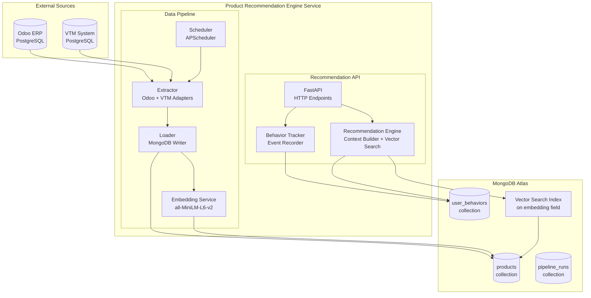
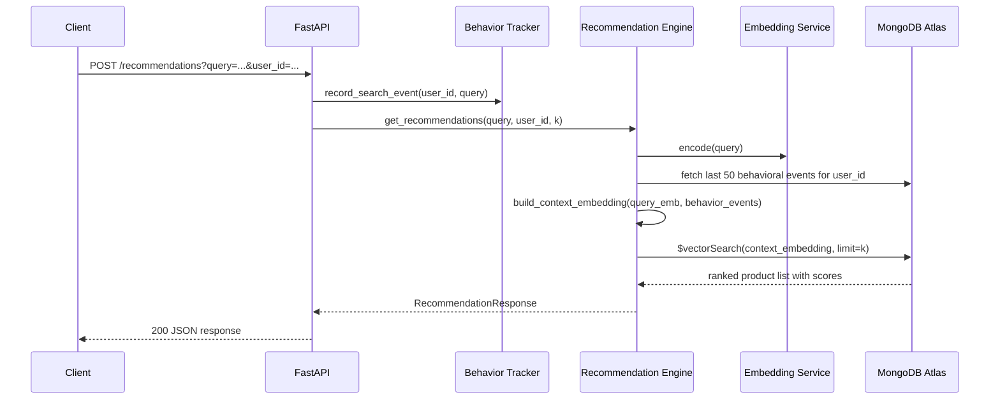
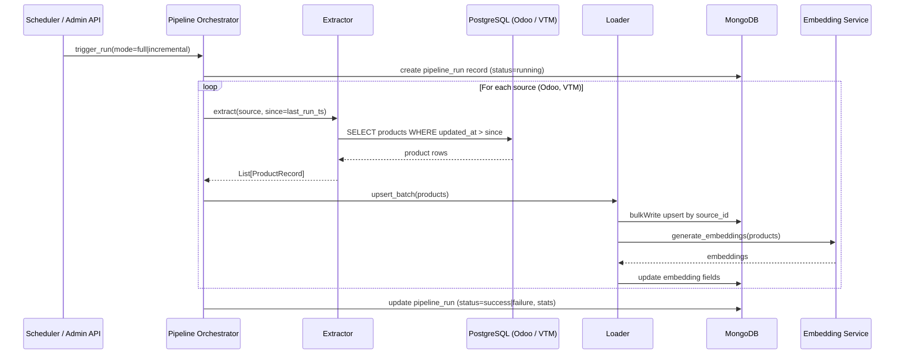

# Design Document

## Product Recommendation Engine

---

## Overview

The Product Recommendation Engine is a Python-based backend service that delivers personalized, semantically relevant product recommendations during user search. It operates as two loosely coupled subsystems:

1. **Data Pipeline** — an ETL process that extracts product records from Odoo ERP and VTM PostgreSQL databases, loads them into MongoDB, and generates vector embeddings for each product.
2. **Recommendation API** — a FastAPI service that accepts search queries, builds a user-context embedding from behavioral history, and executes a MongoDB Atlas Vector Search to return ranked product recommendations.

The system is designed for the MUG VN - MDB Hackathon and targets a single-service deployment. All persistent state lives in MongoDB Atlas, which serves as both the operational store (products, behavioral events, pipeline run metadata) and the vector search engine.

### Key Design Decisions

- **Python + FastAPI**: Async-first, type-safe, and well-suited for both the API layer and the ETL pipeline. FastAPI's dependency injection makes it straightforward to share database clients across routes.
- **sentence-transformers (`all-MiniLM-L6-v2`)**: A lightweight, high-quality embedding model that produces 384-dimensional vectors. It runs locally without external API calls, keeping latency low and costs zero. The same model is used for both product indexing and query encoding, ensuring embedding space consistency.
- **MongoDB Atlas Vector Search**: Provides approximate nearest-neighbor (ANN) search via the HNSW algorithm using the `$vectorSearch` aggregation stage. Cosine similarity is used as the distance metric, which is appropriate for normalized sentence embeddings.
- **APScheduler**: Embedded in the FastAPI process to run the pipeline on a configurable interval (default 24 hours) without requiring an external orchestrator like Airflow or Celery for this hackathon scope.
- **SQLAlchemy (async)**: Used for PostgreSQL connections to both Odoo ERP and VTM, providing a consistent query interface and connection pooling.

---

## Architecture

The system is structured as a single deployable Python service with three internal layers:



### Request Flow (Recommendation)



### Pipeline Flow



---

## Components and Interfaces

### 1. Extractor

Responsible for connecting to PostgreSQL sources and yielding normalized `ProductRecord` objects.

```python
class SourceAdapter(Protocol):
    """Interface that each PostgreSQL source must implement."""
    source_name: str

    async def extract(
        self,
        since: datetime | None = None,  # None = full extraction
    ) -> AsyncIterator[ProductRecord]: ...
```

Two concrete adapters are provided: `OdooAdapter` and `VTMAdapter`. Both implement `SourceAdapter` and use SQLAlchemy async sessions internally.

**Source identifier convention**: `{source_name}:{original_id}` — e.g., `odoo:12345` or `vtm:67890`. This satisfies Requirement 1.3.

### 2. Loader

Accepts batches of `ProductRecord` objects and writes them to MongoDB using `bulkWrite` with `upsert=True` on the `source_id` field.

```python
class Loader:
    async def upsert_batch(self, records: list[ProductRecord]) -> LoadResult: ...
    async def record_load_timestamp(self, source_name: str, ts: datetime) -> None: ...
```

Retry logic (up to 3 attempts with exponential backoff) is implemented inside `upsert_batch` to satisfy Requirement 2.3.

### 3. Embedding Service

Wraps the `sentence-transformers` model and exposes synchronous and async interfaces.

```python
class EmbeddingService:
    def __init__(self, model_name: str = "all-MiniLM-L6-v2"): ...

    def encode(self, text: str) -> list[float]: ...
    def encode_batch(self, texts: list[str]) -> list[list[float]]: ...

    def build_product_text(self, record: ProductRecord) -> str:
        """Concatenates name + description + category for embedding."""
        ...
```

The model is loaded once at startup and reused for all encoding operations. This guarantees embedding space consistency (Requirement 3.4).

### 4. Behavior Tracker

Records user behavioral events to the `user_behaviors` MongoDB collection.

```python
class BehaviorTracker:
    async def record_search(self, user_id: str, query: str, ts: datetime) -> None: ...
    async def record_click(self, user_id: str, product_id: str, ts: datetime) -> None: ...
    async def record_purchase(self, user_id: str, product_ids: list[str], ts: datetime) -> None: ...
    async def get_recent_events(self, user_id: str, limit: int = 50) -> list[BehaviorEvent]: ...
```

For anonymous users, `user_id` is replaced by a `session_id` (Requirement 4.6).

### 5. Recommendation Engine

Orchestrates context building and vector search.

```python
class RecommendationEngine:
    async def get_recommendations(
        self,
        query: str,
        user_id: str | None,
        k: int = 10,
        min_score: float | None = None,
        page: int = 1,
        page_size: int = 10,
    ) -> RecommendationResponse: ...

    def build_context_embedding(
        self,
        query_embedding: list[float],
        events: list[BehaviorEvent],
    ) -> list[float]: ...
```

Context embedding construction (Requirement 5.2–5.3):
- Each event is weighted: purchase = 3.0, click = 2.0, search = 1.0
- The context embedding is a weighted average of the query embedding and the embeddings of the top-N most recent behavioral event texts
- If no behavioral history exists, the query embedding is used directly

### 6. Pipeline Orchestrator

Coordinates extraction, loading, and embedding generation for a full or incremental run.

```python
class PipelineOrchestrator:
    async def run(self, mode: Literal["full", "incremental"]) -> PipelineRunResult: ...
    async def get_status(self) -> PipelineStatus: ...
```

Maintains a `_running` flag to reject concurrent triggers (Requirement 8.4).

### 7. Scheduler

Uses `APScheduler`'s `AsyncIOScheduler` to trigger `PipelineOrchestrator.run()` on a configurable cron interval.

```python
class PipelineScheduler:
    def start(self, interval_hours: int = 24) -> None: ...
    def shutdown(self) -> None: ...
```

### 8. FastAPI Application

Exposes the following HTTP endpoints:

| Method | Path | Description |
|--------|------|-------------|
| `POST` | `/recommendations` | Submit a search query and receive ranked recommendations |
| `POST` | `/events/search` | Record a search event |
| `POST` | `/events/click` | Record a click event |
| `POST` | `/events/purchase` | Record a purchase event |
| `POST` | `/admin/pipeline/trigger` | Manually trigger a pipeline run |
| `GET` | `/admin/pipeline/status` | Get current pipeline run status |
| `GET` | `/health` | Health check |

---

## Data Models

### MongoDB Collections

#### `products` collection

```json
{
  "_id": "ObjectId",
  "source_id": "odoo:12345",
  "source": "odoo",
  "name": "Wireless Keyboard",
  "description": "Compact wireless keyboard with backlight",
  "category": "Electronics",
  "price": 49.99,
  "availability": true,
  "metadata": {},
  "embedding": [0.023, -0.145, ...],
  "embedding_model": "all-MiniLM-L6-v2",
  "created_at": "2024-01-15T10:00:00Z",
  "updated_at": "2024-01-15T10:00:00Z"
}
```

**Indexes**:
- Unique index on `source_id`
- Atlas Vector Search index on `embedding` field (384 dimensions, cosine similarity)

#### `user_behaviors` collection

```json
{
  "_id": "ObjectId",
  "user_id": "user_abc",
  "session_id": "sess_xyz",
  "event_type": "search | click | purchase",
  "query": "wireless keyboard",
  "product_id": "odoo:12345",
  "product_ids": ["odoo:12345", "vtm:67890"],
  "timestamp": "2024-01-15T10:05:00Z"
}
```

**Indexes**:
- Compound index on `(user_id, timestamp)` descending — supports efficient retrieval of recent events
- Index on `session_id` — supports anonymous user lookups

#### `pipeline_runs` collection

```json
{
  "_id": "ObjectId",
  "run_id": "uuid4",
  "mode": "full | incremental",
  "status": "running | success | failure",
  "started_at": "2024-01-15T02:00:00Z",
  "completed_at": "2024-01-15T02:15:00Z",
  "records_processed": {
    "odoo": 1500,
    "vtm": 800
  },
  "errors": []
}
```

### Python Data Models (Pydantic)

```python
class ProductRecord(BaseModel):
    source_id: str          # e.g. "odoo:12345"
    source: str             # "odoo" | "vtm"
    name: str
    description: str
    category: str
    price: float
    availability: bool
    metadata: dict = {}

class BehaviorEvent(BaseModel):
    user_id: str | None
    session_id: str | None
    event_type: Literal["search", "click", "purchase"]
    query: str | None = None
    product_id: str | None = None
    product_ids: list[str] = []
    timestamp: datetime

class RecommendationRequest(BaseModel):
    query: str
    user_id: str | None = None
    session_id: str | None = None
    k: int = 10
    min_score: float | None = None
    page: int = 1
    page_size: int = 10

class RecommendedProduct(BaseModel):
    source_id: str
    name: str
    description: str
    category: str
    price: float
    availability: bool
    similarity_score: float

class RecommendationResponse(BaseModel):
    query: str
    results: list[RecommendedProduct]
    total: int
    page: int
    page_size: int

class PipelineRunResult(BaseModel):
    run_id: str
    status: Literal["success", "failure"]
    started_at: datetime
    completed_at: datetime
    records_processed: dict[str, int]
    errors: list[str]
```

### MongoDB Atlas Vector Search Index Definition

```json
{
  "name": "product_embedding_index",
  "type": "vectorSearch",
  "definition": {
    "fields": [
      {
        "type": "vector",
        "path": "embedding",
        "numDimensions": 384,
        "similarity": "cosine"
      }
    ]
  }
}
```

The `$vectorSearch` aggregation stage used at query time:

```python
pipeline = [
    {
        "$vectorSearch": {
            "index": "product_embedding_index",
            "path": "embedding",
            "queryVector": context_embedding,
            "numCandidates": k * 10,
            "limit": k,
        }
    },
    {
        "$addFields": {
            "similarity_score": {"$meta": "vectorSearchScore"}
        }
    },
    {
        "$match": {
            "similarity_score": {"$gte": min_score}  # applied only when configured
        }
    },
    {
        "$project": {
            "source_id": 1, "name": 1, "description": 1,
            "category": 1, "price": 1, "availability": 1,
            "similarity_score": 1
        }
    }
]
```

---

## Correctness Properties

*A property is a characteristic or behavior that should hold true across all valid executions of a system — essentially, a formal statement about what the system should do. Properties serve as the bridge between human-readable specifications and machine-verifiable correctness guarantees.*

### Property 1: Source ID Format Invariant

*For any* product record extracted from any source system with a given original ID, the assigned `source_id` must equal `"{source_name}:{original_id}"`, and a batch of records with distinct original IDs from the same source must produce distinct `source_id` values.

**Validates: Requirements 1.3**

---

### Property 2: Upsert Idempotence

*For any* product record, upserting it into the Vector_Store twice (with the same `source_id`) must result in exactly one document in the collection — not two. The second upsert must overwrite the first, and the total document count must remain unchanged.

**Validates: Requirements 1.4**

---

### Property 3: Incremental Extraction Filter

*For any* set of product records with varying `updated_at` timestamps and any cutoff timestamp, incremental extraction must return exactly the records whose `updated_at` is strictly greater than the cutoff — no more, no fewer.

**Validates: Requirements 1.6**

---

### Property 4: Product Data Round-Trip

*For any* `ProductRecord` with arbitrary field values, writing it to MongoDB and reading it back must produce a document that (a) contains all original fields with their original values, and (b) contains a non-empty `embedding` field derived from the `name`, `description`, and `category` fields. Furthermore, two products with identical `name`, `description`, and `category` must produce identical embeddings regardless of differences in other fields.

**Validates: Requirements 2.2, 3.1, 3.2**

---

### Property 5: Embedding Regeneration on Update

*For any* product stored in MongoDB, updating its `name`, `description`, or `category` and re-running the embedding step must produce a new embedding that overwrites the old one, resulting in exactly one `embedding` field per document. The new embedding must differ from the original when the text fields have changed.

**Validates: Requirements 3.3**

---

### Property 6: Behavioral Event Storage Round-Trip

*For any* behavioral event (search, click, or purchase) with any combination of `user_id`, `session_id`, `query`, `product_id`, `product_ids`, and `timestamp`, recording the event and then querying by `user_id` (or `session_id` for anonymous users) must return a document containing all the original event fields. When `user_id` is absent, the event must be stored under `session_id` with `user_id` set to null.

**Validates: Requirements 4.1, 4.2, 4.3, 4.4, 4.6**

---

### Property 7: Recent Events Limit

*For any* user with any number of behavioral events (including more than 50), `get_recent_events(user_id, limit=50)` must return at most 50 events, and those events must be the 50 most recent by timestamp.

**Validates: Requirements 5.1**

---

### Property 8: Context Embedding Weighting

*For any* set of behavioral events containing at least one purchase event and at least one search event referencing different products, the context embedding produced by `build_context_embedding` must be more similar (higher cosine similarity) to the embedding of the purchased product than to the embedding of the searched product, reflecting the higher weight assigned to purchase events.

**Validates: Requirements 5.2, 5.3**

---

### Property 9: Empty History Falls Back to Query Embedding

*For any* query embedding vector, `build_context_embedding(query_embedding, events=[])` must return a vector that is equal to `query_embedding` (within floating-point tolerance).

**Validates: Requirements 5.4**

---

### Property 10: Query Embedding Dimensionality Consistency

*For any* query string, `encode(query)` must produce a vector of exactly 384 dimensions — the same dimensionality as product embeddings — ensuring that query vectors and product vectors are comparable in the same embedding space.

**Validates: Requirements 6.1**

---

### Property 11: Recommendation Response Invariants

*For any* recommendation request with a given `k` value and optional `min_score` threshold, the response must satisfy all of the following simultaneously:
- The `results` list contains at most `k` items
- Every item in `results` has a non-null `similarity_score`
- The `similarity_score` values are in non-increasing (descending) order
- If `min_score` is set, no item has `similarity_score < min_score`

**Validates: Requirements 6.3, 6.4, 6.6, 6.7**

---

### Property 12: Valid API Response Schema

*For any* valid recommendation request (with non-empty `query` and optional `user_id`), the HTTP response must be 200 with a JSON body containing a `results` array where each element has `source_id`, `name`, `description`, `category`, `price`, `availability`, and `similarity_score` fields.

**Validates: Requirements 7.2**

---

### Property 13: Missing Parameters Return 400

*For any* recommendation request that omits the required `query` parameter, the HTTP response must be 400 with a JSON body containing a non-empty `detail` or `message` field describing the missing parameter.

**Validates: Requirements 7.3**

---

### Property 14: Pagination Correctness

*For any* result set of size N and any valid `page` and `page_size` values, the paginated response must return exactly `min(page_size, N - (page-1)*page_size)` results (or 0 if the page is beyond the last result), and the results must correspond to the correct offset in the full ranked list.

**Validates: Requirements 7.5**

---

### Property 15: Pipeline Run Record Completeness

*For any* completed pipeline run (success or failure) processing any number of records from any sources, the `pipeline_runs` document must contain: `status` (either "success" or "failure"), `started_at`, `completed_at`, and a `records_processed` map with an entry for each source system that was processed.

**Validates: Requirements 8.3**

---

## Error Handling

### PostgreSQL Connection Failures

- Each source adapter wraps its connection in a try/except block
- On failure, the error is logged with: source name, timestamp, exception type, and message
- The pipeline orchestrator catches per-source errors and continues to the next source
- The pipeline run record captures per-source errors in the `errors` array

### MongoDB Write Failures

- The `Loader.upsert_batch` method retries up to 3 times with exponential backoff (1s, 2s, 4s)
- After 3 failures, the batch is skipped and the error is logged
- The pipeline run record reflects partial success if some batches succeeded

### Embedding Generation Failures

- The `EmbeddingService` catches model inference errors per product
- On failure: logs `product_id` and error reason; does NOT write an empty or partial embedding
- The product document is written without an `embedding` field; it will be retried on the next pipeline run

### API Error Handling

- FastAPI's built-in validation handles missing/malformed request parameters → HTTP 400
- Unhandled exceptions in route handlers are caught by a global exception handler → HTTP 500 with error code
- All 500 errors are logged with full stack trace, request ID, and user context

### Concurrent Pipeline Runs

- The `PipelineOrchestrator` maintains an in-memory `_running: bool` flag
- If `_running` is True when a trigger arrives, the request is rejected with HTTP 409 and a message indicating a run is in progress

---

## Testing Strategy

### Overview

The testing strategy uses a dual approach: **unit/property-based tests** for pure logic and data transformation, and **integration tests** for infrastructure connectivity and end-to-end flows.

**Property-Based Testing Library**: [`hypothesis`](https://hypothesis.readthedocs.io/) (Python)

Each property test is configured to run a minimum of 100 iterations via `@settings(max_examples=100)`.

Each property test is tagged with a comment referencing the design property:
```python
# Feature: product-recommendation-engine, Property N: <property_text>
```

### Unit and Property Tests

**Embedding Service**
- Property tests for Properties 4, 5, 9, 10 using `hypothesis` to generate random product records and query strings
- Verify embedding dimensionality, determinism, and round-trip behavior

**Data Pipeline — Extractor**
- Property test for Property 3: generate random product lists with random timestamps and cutoff values; verify incremental filter correctness
- Property test for Property 1: generate random source names and IDs; verify source_id format

**Data Pipeline — Loader**
- Property test for Property 2: generate random products, upsert twice, verify no duplicates (uses in-memory MongoDB mock via `mongomock`)
- Property test for Property 4: generate random ProductRecord instances, write and read back, verify field preservation

**Behavior Tracker**
- Property test for Property 6: generate random events of all types with random user/session IDs; verify round-trip storage
- Property test for Property 7: generate users with random event counts > 50; verify limit enforcement

**Recommendation Engine**
- Property test for Property 8: controlled event sets with known product embeddings; verify weighting
- Property test for Property 9: random query embeddings with empty event list; verify identity
- Property test for Property 11: mock vector search results with random scores; verify response invariants
- Property test for Property 14: random page/page_size values; verify pagination slicing

**API Layer**
- Property test for Property 12: random valid requests via FastAPI `TestClient`; verify response schema
- Property test for Property 13: random requests with missing `query` field; verify HTTP 400
- Property test for Property 15: random pipeline run outcomes; verify run record completeness

### Integration Tests

- **1.1, 1.2**: Connect to test PostgreSQL instances (Docker Compose), verify extraction of product records with all required fields
- **3.6**: Verify Atlas Vector Search index exists with correct configuration
- **4.5**: Measure behavioral event recording latency under normal conditions
- **6.2**: End-to-end recommendation request against a seeded MongoDB Atlas instance
- **6.5**: Measure end-to-end recommendation response time

### Smoke Tests

- **1.1, 1.2**: PostgreSQL connectivity checks on startup
- **3.6**: Vector Search index existence check on startup
- **8.1**: Scheduler configuration verification

### Test Infrastructure

- **`mongomock`** or **`pymongo` against a local MongoDB** (via Docker): used for unit/property tests that require MongoDB
- **Docker Compose**: spins up test PostgreSQL instances for Odoo and VTM adapters
- **`pytest` + `hypothesis`**: test runner and property-based testing framework
- **FastAPI `TestClient`**: for API-layer tests without a running server
